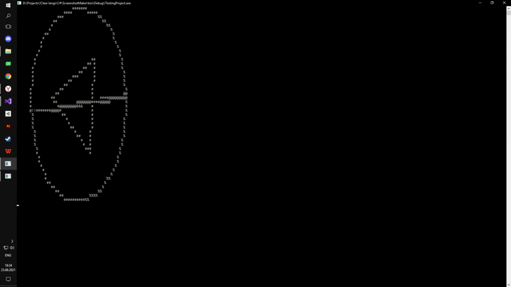

<h1>Console renderer</h1>

The libruary of drawing in the console.
___

____
<h2>What all those files are</h2>
<b>Minor files - there is some count of examples. </b>
<ul>
  <li>Main.cpp file - there is an example of using the interface;</li>
  <li>stdafx.h - there are all used headers for main.cpp file;</li>
</ul>
<b>Main files: headers and classes.</b>
<ul>
  <li>Vector.h - 3Float structure with operators for it;</li>
  <li>ConsoleRenderer.h / ConsoleRenderer.cpp - there is a class for drawing in windows terminal with all base functions for it (set a point, draw line, clear screen and etc);</li>
  <li>Shape.h / Shape.cpp - the base polygon with all its logic was determinated here;</li>
  <li>Shape3D.h / Shape3D.h - this class inherits from Shape and provide to work woth 3D objects.</li>
</ul>
<h2>How to use</h2>
Interface of drawing simple objects like lines and dots is in the ConsoleRenderer.h,
Interfaces of using complicated objects like rectangle and regular polygons are in the Shape.h file. Every single object inherit methods of the main class - Shape class. 
